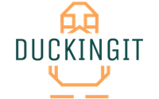

A framework to leverage the endless capabilities of serverless computing powered by DuckDB.

Please note that the framework currently supports only AWS Lambda functions. To use the framework, you must first create a Lambda layer of DuckDB that can be used within a Lambda function. Additionally, you must create a Lambda Executor function that can execute the actual DuckDB SQL. Once you've completed these setup steps, you can leverage the power of serverless functions through the SDK written in Python to perform analytics on a Data Lake.

While Apache Spark can perform similar (and more advanced) functions, the cost of running Spark clusters can be prohibitively expensive. As a result, a much more affordable alternative is to use a cluster of serverless functions, such as Lambda functions, to perform the same actions as Spark, without the need to turn them off manually.

## Installation
To install the Python SDK from PyPI execute the command below. Nonetheless, it's recommended that you first review the [setup](/README.md#setup) section in order to properly utilize the package.

```bash
pip install duckingit
```

## Setup
Before setting up the infrastructure, please make sure that you have installed both Docker and Terraform.

To interact with the DuckDB instances, the entire infrastructure must be set up first because the SDK functions as an entryway to the serverless function cluster. DuckDB is packaged as a layer to be pre-installed in AWS Lambda, similar to other packages. Docker must be installed to create the layer.

Running the command below will generate a duckdb-layer.zip file in the image/release/ folder:
```bash
make release-image
```

To set up the infrastructure on AWS, follow the commands below:
```bash
make release-infra
```

After waiting for a minute or two, the infrastructure should be set up, and you can check for the presence of a Lambda function called DuckExecutor and a lambda layer called duckdb under Lambda layers.

Once you have verified the above components, the infrastructure should be set up and fully operational.

## Usage
The developer API is inspired by the API of Spark, but it uses Python's naming conventions because the framework is implemented in Python.

```python
from duckingit import DuckSession, DuckConfig

query = "SELECT * FROM READ_PARQUET(['s3://BUCKET_NAME/2023/*'])"

# Following command will print possible configurations
DuckConfig.show_configurations()

# Configuration
conf = DuckConfig() \
        .set("aws_lambda.FunctionName", "TestFunc") \
        .set("aws_lambda.MemorySize", 256) \
        .set("aws_lambda.WarmUp", True)

# Creates an entrypoint to use serverless DuckDB instances
session = DuckSession(conf=conf)

# Create a Dataset from the query
ds = session.sql(query=query)

# Execute SQL query
ds.show()
```

... To be continued

## Contribution
Thank you for taking an interest in my project on GitHub. I am always looking for new contributors to help me improve and evolve my codebase. If you're interested in contributing, feel free to fork the repository and submit a pull request with your changes.

I welcome all kinds of contributions, from bug fixes to feature additions and documentation improvements. If you're not sure where to start, take a look at the issues tab or reach out to us for guidance.

Let's collaborate and make our project better together!
