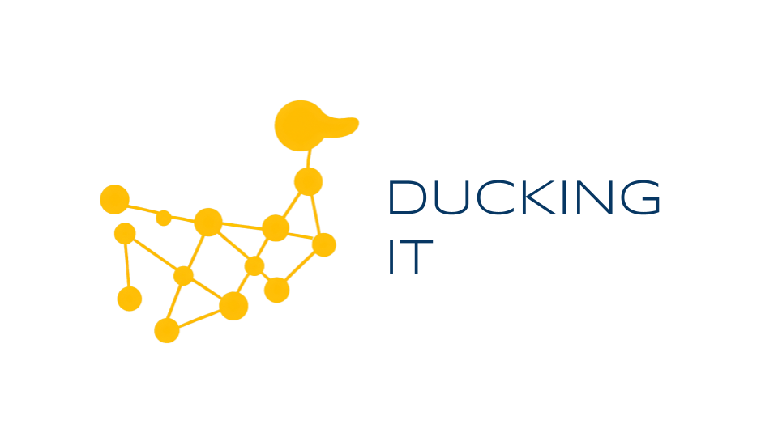

A framework to leverage clusters of serverless functions as a serverless engine for analytics powered by DuckDB and SQLGlot.

While Apache Spark can perform similar (and more advanced) functions, the cost of running Spark clusters can be prohibitively expensive. As a result, a much more affordable alternative is to use a cluster of serverless functions, such as Lambda functions, to perform the same actions as Spark, without the need to turn them off manually.

Currently, the SDK only supports Python 3.10+ and Amazon Web Services (AWS).

__________
Source code: [https://github.com/tobiasegelund/duckingit](https://github.com/tobiasegelund/duckingit)