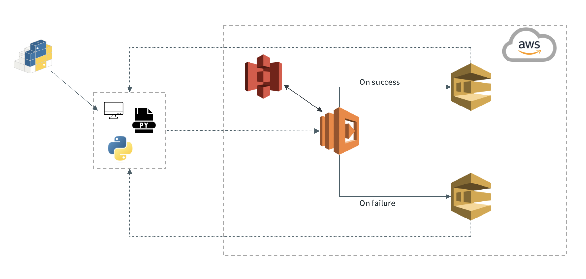

*Ducking it* is the interface to utilize the a serverless functions as a serverless engine for analytics. Therefore, serverless services must be created and connected in order to for *ducking it* to work.

Below image gives an high-level overview of the infrastructure used to achieve a serverless engine. The example uses Amazon Web Services (AWS) to showcase it. Here we uses following serverless services provided by AWS.
- AWS Lambda
- AWS Simple Queue Service (SQS)
- AWS Simple Storage Service (S3)

In the local environment, there is a tool called *duckingit* installed, which enables communication with AWS. *Duckingit* utilizes AWS Lambda to fetch and write data between AWS S3 and AWS Lambda based on an execution plan. As AWS Lambda functions are invoked asynchronously, we gather information about the status of each invoked function in SQS, which we continuously poll. This approach allows us to determine when the operations are completed or if any failures occurred.

There are three options to create the needed services in the right order.
- Manually through the console
- Terraform scripts
- Python using boto3

The infrastructure written in Terraform can be downloaded [here](https://github.com/tobiasegelund/duckingit/tree/main/infrastructure/).

## Amazon Web Services (AWS)

## Google Cloud Products (GCP)
Not implemented yet

## Microsoft Azure
Not implemented yet